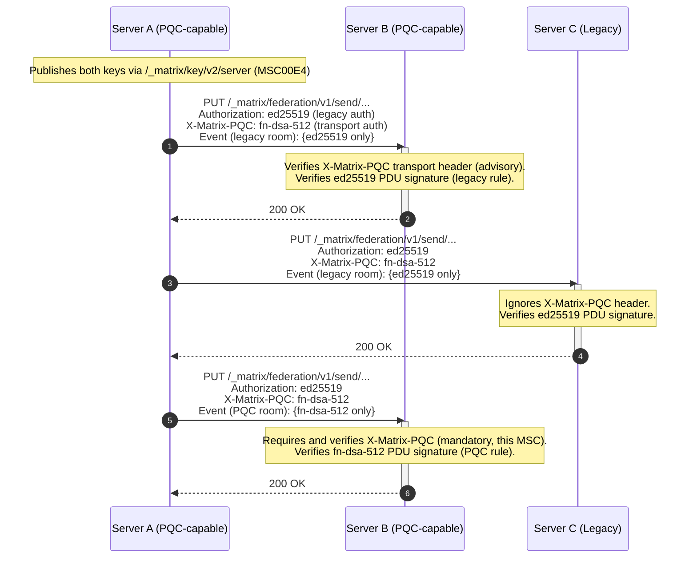

# MSC 00E2: Post-Quantum PDU Signatures for Federation (PQC Room Versions)

Matrix PDU signing currently uses `ed25519`. Quantum computers can theoretically
reverse engineer private keys using Shor's algorithm, breaking elliptic-curve
and RSA schemes — allowing an attacker to forge new events in a server's name.

This MSC introduces a **new room version** in which PDUs are signed with the
post-quantum signature scheme `fn-dsa-512`, and upgrades federation transport
verification from advisory to mandatory for traffic scoped to such rooms.

It builds directly on
[MSC00E4: Post-quantum server keys and minting](./00E4-quantum-sigs-minting-server-keys.md),
which defines FN-DSA server-key minting, key identifiers, self-signature
requirements, notary observations, and advisory TLS provenance. Optional
session-based transport authentication is defined separately in
[MSC 00E5](./00E5-quantum-sigs-federation-session-negotiation.md). Readers
should be familiar with the server-key minting and trust model before deploying
this MSC. E2EE device and cross-signing key migration is addressed separately in
[MSC 00EA](./00EA-quantum-sigs-e2ee.md).

## Proposal

This MSC uses **FN-DSA-512** (`fn-dsa-512`) as defined by the companion
post-quantum server-key MSCs. Public key encodings, signature encodings, and the
signing operation (Canonical JSON of the event with `signatures` and `unsigned`
removed; pure mode; empty context) are inherited from that server-key profile
and are not redefined here. Server signing keys are minted, published,
discovered, pinned, and rotated per MSC00E4 and MSC4499.

> **Note:** For readability, this proposal uses the intended stable identifiers
> `fn-dsa-512` (key algorithm, defined by MSC00E4) and a stable room version
> throughout the main text and examples. Until the relevant MSCs are accepted
> and merged into the Matrix specification, implementations MUST use the
> unstable identifiers `tk.nutra.msc45xx.fn-dsa-512` (algorithm — the canonical
> prefix defined by the server-key MSC where the algorithm is specified) and
> `tk.nutra.msc45yy.pqc.v1` (room version). See
> [Unstable Prefix](#unstable-prefix) for the full mapping.

### PDU Signing

PQC PDU signatures are strictly gated to a new room version. Legacy room
versions are unchanged.

#### Legacy Room Versions

In older room versions, servers continue to sign and verify PDUs using Ed25519
only. Servers MUST NOT append `fn-dsa-512` signatures to PDUs in legacy rooms,
as this introduces unnecessary bloat and risks consensus divergence.

#### PQC-Required Room Versions

In room versions that require PQC signatures (see
[Room Version Requirements](#room-version-requirements)):

- Origin servers MUST sign all outgoing PDUs with `fn-dsa-512`.
- Origin servers MUST NOT include `ed25519` signatures on PDUs in PQC room
  versions.
- Receiving servers MUST require a valid `fn-dsa-512` signature from the server
  whose signature is required by the existing event signature verification rules
  for that room version. If no valid FN-DSA signature is present, the event MUST
  be rejected.
- Receiving servers MUST reject the event if the required `fn-dsa-512` signature
  references a malformed key ID, or if the referenced key was advertised under a
  `short_key_id` that does not match the first 20 base64url characters of the
  key's full `key_id`, as defined by MSC00E4.
- Receiving servers MUST NOT trial-verify multiple FN-DSA key bodies for the
  same `(server_name, algorithm, short_key_id)` tuple. Collisions are handled by
  the server-key cache's First Seen Wins rule; if the bound key body does not
  verify the event, the event fails signature verification.
- Receiving servers MUST ignore unrecognized or legacy signature algorithm
  entries in the `signatures` object; the presence of additional signatures
  (e.g., `ed25519`) MUST NOT cause event rejection. This prevents a
  signature-mutation denial-of-service where an intermediary appends a legacy
  signature to an otherwise-valid PQC event — since signatures are excluded from
  event IDs and content hashes, such mutation is always possible. This
  sender/receiver asymmetry is intentional: origin servers are required to emit
  a canonical PQC-only signature set, while receivers are required to tolerate
  extra signatures because the `signatures` object is not covered by the event
  identifier and may be mutated in transit.

```json
{
  "signatures": {
    "example.com": {
      "fn-dsa-512:5FQ2xg4sWqj3Kp9N": "<base64-fn-dsa-512-signature>"
    }
  }
}
```

### Event ID and Content Hash Computation

Event IDs (room versions 3+) and content hashes (`hashes.sha256`) are computed
**excluding signatures**. Adding FN-DSA signatures therefore changes neither
event IDs nor content hashes.

### Canonical Event Hash (`canonical_sha256`)

In PQC room versions, origin servers MUST compute an additional hash —
`canonical_sha256` — over the **entire event including signatures**. This field
is placed alongside the existing content hash in the `hashes` object:

```json
{
  "hashes": {
    "sha256": "<content-hash-excluding-signatures>",
    "canonical_sha256": "<hash-over-entire-event-including-signatures>"
  }
}
```

**Computation.** The `canonical_sha256` hash is computed as follows:

1. The event is first finalized: `hashes.sha256` (the content hash) and
   `signatures` are computed and populated using the existing algorithm.
2. The `canonical_sha256` key is removed from `hashes` if present, and the
   `unsigned` property is removed.
3. The resulting object (which now contains `signatures` and `hashes.sha256`,
   but not `unsigned` or `canonical_sha256`) is serialized to
   [Canonical JSON](https://spec.matrix.org/v1.14/appendices/#canonical-json).
4. A SHA-256 hash is computed over the resulting JSON bytes.
5. The hash is encoded as unpadded base64 and placed in
   `hashes.canonical_sha256`.

**Semantics.** The `canonical_sha256` is a notarization commitment: it records
the exact cryptographic state of the event — content, topology, and authorship
signatures — as finalized by the origin server. Unlike the Event ID (reference
hash) and content hash, it **covers the `signatures` dictionary**.

**Verification.** Receiving servers SHOULD verify the `canonical_sha256` when
present. To verify:

1. Extract and save the `canonical_sha256` value from `hashes`.
2. Remove `canonical_sha256` from `hashes` and remove `unsigned` from the event.
3. Filter the `signatures` dictionary: retain **only** the entry whose top-level
   key matches the event's origin server name (derived from the `sender` field's
   domain). Discard all other co-signatures (e.g., resident server signatures
   appended during `/send_join`).
4. Serialize the remaining object to Canonical JSON and compute SHA-256.
5. Compare the computed hash with the saved value.

If verification fails, the receiving server SHOULD log a warning. A
`canonical_sha256` mismatch indicates that the `signatures` dictionary was
mutated in transit (e.g., a spurious signature was appended by an intermediary).
The event MUST NOT be rejected solely due to a `canonical_sha256` mismatch — the
Event ID and content hash remain the authoritative acceptance criteria. The
`canonical_sha256` is an integrity signal, not an acceptance gate.

**Redactions.** Because the `canonical_sha256` is computed over the unredacted
event JSON, it is mathematically impossible to verify this hash after an event
has been redacted (as the original `content` fields have been permanently
stripped). PQC room versions therefore preserve `hashes.canonical_sha256`
through redaction as historical audit metadata only. Receiving servers MUST NOT
attempt to verify `canonical_sha256` on redacted events, and MUST NOT emit
warnings for verification failures on them.

**Interaction with co-signing.** The `canonical_sha256` is computed by the
**origin server only**, before any co-signatures are appended. When a resident
server appends a co-signature during `/send_join`, the `canonical_sha256` will
no longer match the event's full signature set — this is expected and correct.
The verification procedure above (step 3) accounts for this by filtering the
`signatures` dictionary to the origin server's entry only.

**Rationale.** While Event IDs must remain signature-independent (for the
reasons documented in
[Alternatives: Deterministic hash chaining](#alternatives)), `canonical_sha256`
provides an audit trail that enables servers to detect signature mutation
without changing event identity. In a PQC context where FN-DSA signatures are
~10× larger than Ed25519, detecting unauthorized signature injection is valuable
for bandwidth and storage integrity monitoring.

### Federation Transport Enforcement

The post-quantum server-key profile defines the `X-Matrix-PQC` header with
advisory-but-verified semantics. MSC 00E5 defines the optional
`X-Matrix-PQC-Session` equivalent. This MSC upgrades enforcement to be
**room-scoped**, to avoid an indefinitely downgradeable transport layer while
leaving legacy traffic untouched:

- **PQC-room traffic:** If the receiving server can determine that a request
  concerns a PQC-required room (e.g., room-specific endpoints such as
  `/make_join`, `/send_join`, `/make_leave`, `/send_leave`, `/invite`, `/state`,
  `/state_ids`, `/backfill`, `/get_missing_events`, or `/event` when the
  resolved event belongs to a PQC room), a valid `X-Matrix-PQC` header (or valid
  `X-Matrix-PQC-Session` MAC, per MSC 00E5) MUST be present. Requests lacking
  valid PQC transport authentication MUST be rejected with HTTP
  `401 Unauthorized`.
- **Mixed transactions:** For `PUT /_matrix/federation/v1/send/{txnId}`
  transactions containing at least one PDU destined for a PQC-required room,
  valid PQC transport authentication MUST be present. If absent or invalid, the
  receiving server MUST reject the entire transaction with HTTP
  `401 Unauthorized`. Sending servers SHOULD avoid mixing PQC-room and
  legacy-room PDUs in the same transaction where possible.
- **Legacy-only traffic:** For requests that do not involve any PQC-required
  room, the advisory semantics of the server-key profile continue to apply:
  verification failure SHOULD be logged as a warning but MUST NOT cause request
  rejection, provided the Ed25519 `Authorization` header is valid.
- **Legacy servers:** Servers that do not support the post-quantum server-key
  profile ignore the `X-Matrix-PQC` header entirely — and cannot participate in
  PQC-required rooms, since they can neither produce nor verify `fn-dsa-512` PDU
  signatures.

#### Enforcement Order of Operations

For endpoints where the room version is not immediately apparent from the
request path (e.g., `/event/{eventId}`), enforcement proceeds as follows:

1. Validate Ed25519 `Authorization` header.
2. Parse request path and/or body to determine the target room.
3. Determine whether the target room uses a PQC-required room version.
4. If PQC-required, validate PQC transport authentication and reject with `401`
   if absent or invalid.
5. Process the request.

The Ed25519 `Authorization` header remains required on all federation requests
as long as any legacy room version exists in the federation.

### Interaction Sequence



### Migration Timeline

**Phase 1 — Transport & Key Distribution (MSC00E4, prerequisite)** Servers
publish FN-DSA keys via `/_matrix/key/v2/server` and transmit the `X-Matrix-PQC`
header. PDUs continue to be signed exclusively with Ed25519. Wide deployment of
Phase 1 pre-distributes and pins keys across the federation before anything
depends on them.

**Phase 2 — PQC Room Version (this MSC)** A new room version is formalized which
makes `fn-dsa-512` the sole, authoritative PDU signature scheme, and makes PQC
transport authentication mandatory for traffic scoped to such rooms. Users and
administrators may upgrade existing rooms to this version to gain post-quantum
PDU signatures. Legacy rooms remain untouched.

## Room Version Requirements

This MSC requires a **new room version**. All PQC changes are scoped to this
version — existing room versions are unaffected.

- **PDU signing:** Origin servers MUST sign PDUs with `fn-dsa-512`. Origin
  servers MUST NOT include `ed25519` signatures. Receiving servers MUST ignore
  unrecognized or legacy signature entries — their presence MUST NOT cause
  rejection (see [PQC-Required Room Versions](#pqc-required-room-versions) for
  rationale).
- **Signature verification in auth rules:** Step 5 of the
  [checks performed on receipt of a PDU](https://spec.matrix.org/v1.14/server-server-api/#checks-performed-on-receipt-of-a-pdu)
  ("Passes signature checks...") is modified to require strict verification of
  the `fn-dsa-512` signature from the server whose signature is required by the
  existing event signature verification rules for that room version. If no valid
  FN-DSA signature from the expected server is present, the event MUST be
  rejected. Additional signatures from unrecognized or legacy algorithms are
  ignored for acceptance purposes. _(Note: Signatures from other servers MUST
  still be verified if required by the event type, such as resident server
  co-signatures on room joins)._
- **Redaction algorithm:** The `signatures` field behavior is unchanged —
  redacted events retain all signatures, including FN-DSA signatures. The
  redaction algorithm additionally preserves `hashes.canonical_sha256` when
  present, but only as non-gating audit metadata.
- **Event format:** The `hashes` object is extended with a `canonical_sha256`
  field (see [Canonical Event Hash](#canonical-event-hash-canonical_sha256)).
  FN-DSA signatures are entries in the existing `signatures` object. The
  `canonical_sha256` field MUST be preserved through redaction.

The new room version does **not** change:

- State resolution algorithm (remains v2)
- Event ID computation (reference hash is signature-independent)
- Auth rules (beyond the signature verification step)
- Redaction rules (beyond preserving `hashes.canonical_sha256` as audit-only
  metadata)

## Potential Issues

- **Signature size increase.** FN-DSA-512 signatures are 666 raw bytes, encoded
  as 888 unpadded base64 characters, vs Ed25519's 64 raw bytes. Even 10
  co-signatures consume about 8.8 KB of base64 signature material, well within
  the 65 KB PDU limit.

- **Signature permanence.** The 888 base64 characters per FN-DSA signature are
  permanent — signatures cannot be pruned because Event IDs (Room Version 3+)
  are computed _without_ them, so the DAG commits to content but not authorship.
  Every event must retain its signature for independent verification. See
  [Performance & Lightweighting Opportunities](#performance--lightweighting-opportunities).

- **FIPS 206 not yet finalized.** See MSC00E4 for full pre-finalization
  deployment guidance. The room-version consequence specific to this MSC is
  covered under [Unstable Prefix](#unstable-prefix): draft-scoped PQC rooms may
  require an upgrade if the final standard is incompatible.

- **Room upgrades required.** As with any room version, existing rooms gain PQC
  protection only via a room upgrade (`m.room.tombstone`), with the usual
  operational friction. History in the predecessor room remains Ed25519-signed;
  post-quantum authorship guarantees apply from the upgrade point forward.

- **Ecosystem readiness gate.** A PQC-required room is unusable by servers that
  have not implemented MSC00E4 + this MSC. This is intentional (it is the
  security property), but community rooms should weigh reachability before
  upgrading.

## Alternatives

- **Hybrid Ed25519 + PQC PDU signing.** NIST SP 800-227 recommends hybrid
  constructions, but this MSC avoids hybrid PDU signing — in PQC rooms, FN-DSA
  is the sole authority. Dual mandatory signatures would double verification
  work, complicate the auth rules (which signature wins on partial failure?),
  and add permanent per-event bloat, while the transport layer already remains
  hybrid during transition.

- **Signature hash-chaining (future storage savers for highly co-signed
  events).** To reduce the payload tax of multiple co-signatures, subsequent
  co-signers could commit to a hash of previous signatures and discard the
  originals. This fails under Matrix's zero-trust model: a hash commitment
  proves a blob existed (integrity) but cannot prove it was a valid
  cryptographic signature (authenticity) without the original bytes. Every
  server must independently verify signatures, so linear storage of PQC
  signatures is a strict requirement. Sub-linear compression requires schemes
  that preserve verifiability, such as Zero-Knowledge Proofs or future
  post-quantum aggregate signatures.

- **Deterministic hash chaining (signature-inclusive Event IDs).** A related
  proposal is to redefine Event ID computation to canonically hash the entire
  event, _including_ the `signatures` dictionary. If event N+1 references event
  N by its signature-inclusive hash, the DAG implicitly commits to the exact
  signature set of event N, theoretically allowing the original signatures to be
  pruned once a successor exists. This is fundamentally incompatible with
  Matrix's zero-trust federation model:
  1. **Zero-trust violation.** Independent verification is a core invariant.
     Every server must independently verify historical signatures during state
     resolution, backfill, or gap-fill. If signatures are pruned, late-joining
     servers must blindly trust the chain rather than verifying the
     cryptography.
  2. **Identity mutation DoS.** If signatures were part of the Event ID, any
     intermediary server could fork the DAG by appending a spurious signature to
     an event in transit — creating a mathematically distinct Event ID for
     identical content. This is the exact class of attack that motivated the
     Room Version 3 redesign (MSC1659).
  3. **Co-signing paradox.** The `/send_join` protocol requires the resident
     server to append its co-signature to the joining server's event. If
     signatures were hashed into the Event ID, the joining server and the rest
     of the federation would compute different Event IDs for the same join
     event, permanently splintering the DAG.
  4. **DAG topology.** Matrix's DAG contains forks and merges. There is no
     single linear canonical successor to cleanly anchor a signature commitment.

  Matrix explicitly excludes signatures from the Event ID so that the DAG
  commits to content, not authorship, by design (Room Version 3+). Changing this
  would be a fundamental protocol redesign, not an optimization. The
  [`canonical_sha256`](#canonical-event-hash-canonical_sha256) field provides
  the useful subset of this idea — mutation detection — without touching event
  identity.

- **Extending Olm/Megolm to PQC.** Key agreement migration (Curve25519 → ML-KEM)
  is orthogonal and far more complex. Bundling would delay everything. Signature
  migration provides immediate protection against server impersonation; key
  agreement (the HNDL concern) is addressed separately (see MSC 00EA).

- **Alternative signature schemes (ML-DSA, SLH-DSA).** Discussed in MSC00E4,
  where the algorithm is selected. The per-event permanence argument weighs even
  more heavily here: ML-DSA-44's 2.4 KB signatures would be stored forever on
  every event, and SLH-DSA's 17 KB signatures would approach the PDU size limit
  on heavily co-signed events.

## Performance & Lightweighting Opportunities

PQC means larger keys and signatures, and PDU signatures — unlike transport
headers — are stored forever.

### Payload Optimization: Binary Encodings (Informational)

Base64-in-JSON inflates payloads by 33% (~220 wasted bytes per FN-DSA
signature). The PQC room version is an ideal catalyst to adopt CBOR (MSC2432).

### HTTP Overhead

Per-request transport overhead and its amortization via PQ KEM session
negotiation are addressed in MSC 00E5; they are not room-version concerns.

## Security Considerations

- **Real-time impersonation.** Matrix's SHA-256 DAG provides integrity for
  already-referenced historical events. The primary real-time threat is an
  attacker deriving a server's Ed25519 private key to forge _new_ events and
  spoof federation traffic. This MSC closes that attack vector for upgraded
  rooms by requiring post-quantum signatures for PDUs in PQC room versions and
  making post-quantum transport authentication mandatory for PQC-room traffic.

- **Downgrade attacks (federation).** PDU signatures are bound to room versions
  — stripping FN-DSA from a PQC room event invalidates it. Federation transport
  authentication is enforced for requests scoped to PQC rooms, preventing
  transport-level downgrade for PQC traffic. For legacy-only traffic, transport
  auth remains advisory during transition.

- **Signature-mutation resistance.** Because signatures are excluded from event
  IDs and content hashes, intermediaries can mutate the `signatures` object
  without altering event identity. This MSC defends against signature-mutation
  denial-of-service by requiring receivers to ignore unknown or legacy signature
  entries rather than rejecting events that contain them, and provides mutation
  _detection_ via `canonical_sha256`.

- **Timing side-channels.** FN-DSA's discrete Gaussian sampler leaks private
  keys via timing analysis if implemented incorrectly. All implementations MUST
  use audited, constant-time libraries.

- **Downgrade attacks (E2EE).** E2EE downgrade risks are addressed in
  [MSC 00EA](./00EA-quantum-sigs-e2ee.md).

- **Key compromise recovery.** Identical to Ed25519: rotate the key, publish the
  old key in `old_verify_keys` with `expired_ts` (subject to the MSC00E4 FN-DSA
  rotation-authentication rule). Events signed with the compromised key cannot
  be retroactively invalidated.

## Unstable Prefix

While this MSC is in development, the following unstable identifiers are used:

| Stable Identifier            | Unstable Identifier                                |
| ---------------------------- | -------------------------------------------------- |
| PQC room version             | `tk.nutra.msc45yy.pqc.v1`                          |
| `fn-dsa-512` (key algorithm) | `tk.nutra.msc45xx.fn-dsa-512` (defined by MSC00E4) |
| `canonical_sha256` (hashes)  | `tk.nutra.msc45yy.canonical_sha256`                |

The algorithm identifier is namespaced under MSC00E4, where the algorithm is
specified; this MSC does not define a second algorithm prefix. During the
unstable period, PDU `signatures` entries use the unstable algorithm identifier:

```json
{
  "room_version": "tk.nutra.msc45yy.pqc.v1",
  "hashes": {
    "sha256": "<content-hash>",
    "tk.nutra.msc45yy.canonical_sha256": "<canonical-hash>"
  },
  "signatures": {
    "example.com": {
      "tk.nutra.msc45xx.fn-dsa-512:5FQ2xg4sWqj3Kp9N": "<base64-fn-dsa-512-signature>"
    }
  }
}
```

Once this MSC is accepted but not yet merged into a released spec version,
implementations SHOULD support both the unstable identifiers and the stable
identifiers, accepting either.

### Pre-Finalization Deployment Guidance

The constraints in MSC00E4 (draft-revision pinning, provisional keys, rotation
on parameter change, no production trust assumptions) apply in full. One
constraint is specific to this MSC:

- **PQC room versions are draft-scoped.** Rooms created with a PQC-required room
  version during the unstable period are bound to the draft revision active at
  creation time. If the final standard is incompatible, these rooms cannot be
  migrated in-place — a new room version referencing the final standard would be
  required, and rooms would need to be upgraded.

## Dependencies

- **[MSC00E4](./00E4-quantum-sigs-minting-server-keys.md):** Defines FN-DSA
  server-key minting, key identifiers, server key distribution and trust model,
  and notary provenance. This MSC cannot be accepted before MSC00E4.
- **[MSC 00E5](./00E5-quantum-sigs-federation-session-negotiation.md):** Defines
  optional session authentication that can replace per-request `X-Matrix-PQC`
  signatures where this MSC permits `X-Matrix-PQC-Session`.
- **NIST FIPS 206 (FN-DSA):** Inherited via MSC00E4.

## Backwards Compatibility

This proposal is backwards-compatible for existing room versions and legacy PDU
verification:

- **All PDU format and auth-rule changes are isolated to the new room version.**
  Rooms that are not upgraded continue to use Ed25519. This spec gives no advice
  on backporting to legacy rooms.
- **Transport enforcement is room-scoped.** Legacy-room traffic keeps the
  advisory semantics of the server-key profile; only PQC-room traffic gains
  mandatory enforcement.
- **No new endpoints.** Existing endpoints are extended in behavior only (PQC
  signature requirements, room-scoped header enforcement).
- **E2EE backwards compatibility.** E2EE device and cross-signing key migration
  is addressed in [MSC 00EA](./00EA-quantum-sigs-e2ee.md) and is fully
  backwards-compatible.

---

## MSC Checklist

- [ ] Are
      [appropriate implementation(s)](https://spec.matrix.org/proposals/#implementing-a-proposal)
      specified in the MSC's PR description?
- [ ] Are all MSCs that this MSC depends on already accepted? (Depends on MSC
      00E4 and MSC 00E5.)
- [x] For each endpoint that is introduced or modified:
  - [x] Have authentication requirements been specified? (Room-scoped PQC
        transport authentication on existing federation endpoints; no new
        endpoints.)
  - [x] Have rate-limiting requirements been specified? (Unchanged from existing
        federation endpoints.)
  - [x] Have guest access requirements been specified? (N/A — server-to-server
        API.)
  - [x] Are error responses specified?
    - [x] Does each error case have a specified `errcode` (i.e. `M_FORBIDDEN`)
          and HTTP status code? (`401 Unauthorized` for missing/invalid PQC
          transport authentication on PQC-room traffic.)
      - [x] If a new `errcode` is introduced, is it clear that it is new? (No
            new errcodes.)
  - [x] Are the
        [endpoint conventions](https://spec.matrix.org/latest/appendices/#conventions-for-matrix-apis)
        honoured?
    - [x] Do HTTP endpoints `use_underscores_like_this`?
    - [x] Will the endpoint return unbounded data? If so, has pagination been
          considered? (N/A.)
    - [x] If the endpoint utilises pagination, is it consistent with
          [the appendices](https://spec.matrix.org/latest/appendices/#pagination)?
          (N/A.)
- [x] Will the MSC require a new room version, and if so, has that been made
      clear?
  - [x] Is the reason for a new room version clearly stated? For example,
        modifying the set of redacted fields changes how event IDs are
        calculated, thus requiring a new room version. (PDU signature
        requirements and the `hashes` event format change are consensus rules,
        and so must be gated on a room version.)
- [x] Are backwards-compatibility concerns appropriately addressed?
- [x] An introduction exists and clearly outlines the problem being solved.
      Ideally, the first paragraph should be understandable by a non-technical
      audience.
- [ ] All outstanding threads are resolved
  - [ ] All feedback is incorporated into the proposal text itself, either as a
        fix or noted as an alternative
- [x] There is a dedicated "Security Considerations" section which detail any
      possible attacks/vulnerabilities this proposal may introduce, even if this
      is "None.". See [RFC3552](https://datatracker.ietf.org/doc/html/rfc3552)
      for things to think about, but in particular pay attention to the
      [OWASP Top Ten](https://owasp.org/www-project-top-ten/).
- [x] The other section headings in the template are optional, but even if they
      are omitted, the relevant details should still be considered somewhere in
      the text of the proposal. Those section headings are:
  - [x] Introduction
  - [x] Proposal text
  - [x] Potential issues
  - [x] Alternatives
  - [x] Unstable prefix
  - [x] Dependencies
- [x] Stable identifiers are used throughout the proposal, except for the
      unstable prefix section
  - [x] Unstable prefixes
        [consider](https://github.com/matrix-org/matrix-spec-proposals/blob/main/README.md#unstable-prefixes)
        the awkward accepted-but-not-merged state
  - [x] Chosen unstable prefixes do not pollute any global namespace (use
        "tk.nutra.msc45yy", not "tk.nutra").
- [ ] Changes have applicable
      [Sign Off](https://github.com/matrix-org/matrix-spec-proposals/blob/main/CONTRIBUTING.md#sign-off)
      from all authors/editors/contributors
